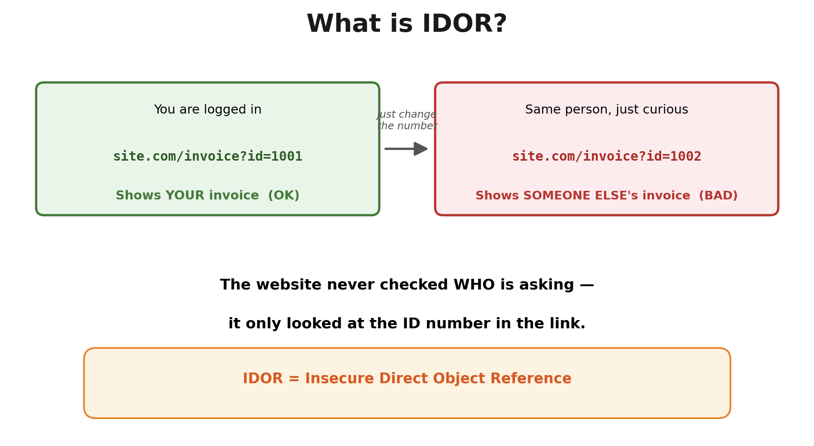

# What is IDOR?

IDOR stands for Insecure Direct Object Reference.

Insecure direct object references (IDOR) are a type of access control vulnerability that arises when an application uses user-supplied input to access objects directly.

**In simple words:** a website shows you something (like an invoice, a photo, or a profile) by using an ID number in the link. If the website forgets to check WHO is asking, you can just change that number and see someone else's stuff.

---

# Why Does IDOR Happen?

It happens because of one simple mistake: the server trusts the ID in the link, but never checks if that ID actually belongs to the person asking for it.

- The developer only checked "does this ID exist?" — not "does this ID belong to THIS user?"
- IDs are simple numbers (1, 2, 3...) so they are easy to guess
- The same mistake can happen in URLs, API requests, hidden form fields, or mobile app requests
- Teams are in a rush and skip permission checks to save time

---

# Where Can You Find IDOR?

- URLs with numbers: `?id=`, `?user=`, `?order=`, `?invoice=`
- API endpoints: `/api/users/105`, `/api/orders/205`
- File downloads: `/download?file=report_105.pdf`
- Hidden fields in forms (`account_id`, `profile_id`)
- Mobile app traffic captured with a proxy tool

> [!TIP]
> Sometimes the ID does not look like a simple number. It might look like a random string of letters and numbers. Many beginners assume this means it is safe. It usually is not.

**For example:**

- Hex encoding: `id=3132` decodes to `id=12`
- Base64 encoding: `aWQ9MTIz` decodes to `id=123`
- Simple math tricks: an ID multiplied or shifted by a fixed number is still guessable once you spot the pattern

---

# How to Prevent IDOR?

- Check permissions on the SERVER for every request — never trust the client
- Confirm the logged-in user actually owns or is allowed to access that specific ID
- Use random, hard-to-guess IDs (like UUIDs) instead of simple counting numbers
- Apply the same checks everywhere: web pages, APIs, mobile endpoints, admin panels
- Test your own app regularly by swapping IDs between two test accounts

---

# Some Important Questions

### Just use random IDs. Is it OK?

### Can Parameter Pollution be used to exploit IDOR?

---

# References

- PortSwigger – IDOR  
  https://portswigger.net/web-security/access-control/idor

- OWASP Top 10 – Broken Access Control  
  https://owasp.org/Top10/A01_2021-Broken_Access_Control/

- OWASP Web Security Testing Guide (WSTG)  
  https://owasp.org/www-project-web-security-testing-guide/

- OWASP Insecure Direct Object Reference Prevention Cheat Sheet  
  https://cheatsheetseries.owasp.org/cheatsheets/Insecure_Direct_Object_Reference_Prevention_Cheat_Sheet.html

- HackTricks – IDOR  
  https://hacktricks.wiki/en/pentesting-web/idor.html

